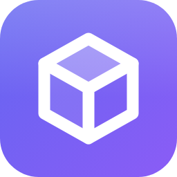
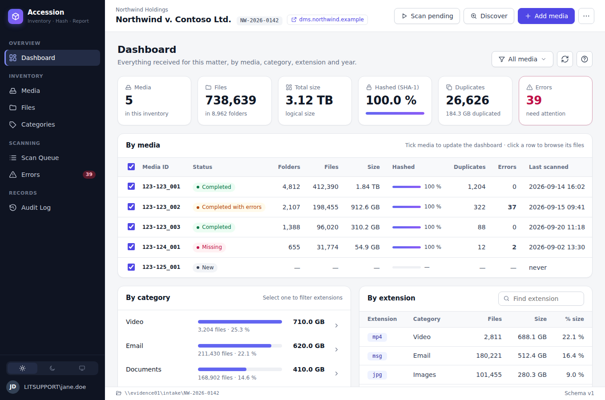
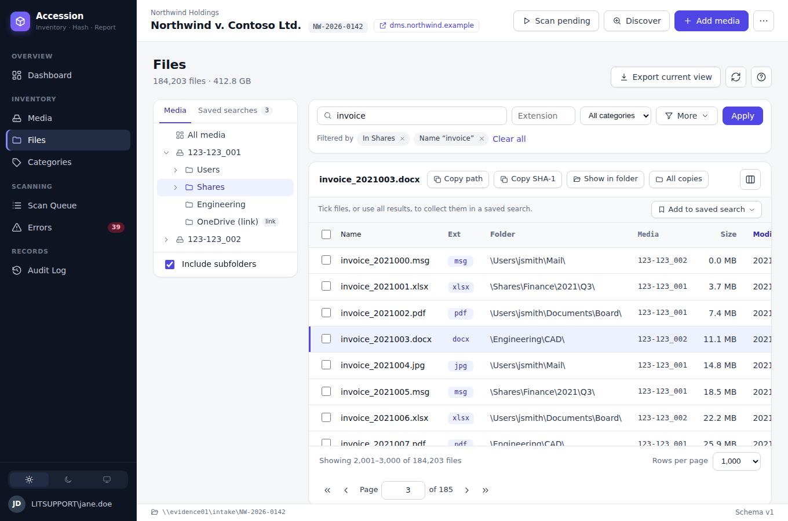

#  Accession

*Inventory, hash, and report every media you receive.*

Accession is a Windows desktop application for eDiscovery teams. It scans media folders on a
network share, records every folder and file (with metadata and SHA-1 hash) into a single SQLite
inventory file, shows dashboards by media, category and extension, and exports the inventory to Excel.

Requirements: [`requirements/001-initial_requirements.md`](requirements/001-initial_requirements.md)

## Download

Get the installer, **Accession-&lt;version&gt;-x64.msi**, from the
[latest release](https://github.com/plogramer/Accession/releases/latest) and run it. It needs Windows 10 (1809) or 11,
64-bit, and nothing else (.NET is included; WebView2 comes with Windows). The installer is not code-signed yet, so Windows
may warn about an unknown publisher: choose *More info* → *Run anyway*. The app checks for new versions itself.

## Screenshots

**Dashboard** – totals, media, categories, extensions, duplicates and files by year, for all media or the ones you tick.



**Files** – every file with its folder, size, dates and SHA-1: browse by media and folder, filter, tick files to copy them
or collect them in saved searches.



*Sample data. More screens are in the in-app help ([`src/Accession.App/wwwroot/help`](src/Accession.App/wwwroot/help/index.html)).*

## Version history

The version is set in [`Directory.Build.props`](Directory.Build.props) (`<Version>`) and shown in the app. Newest first.

### 0.1 – 2026-09-28

First version. Inventory schema version 3.

- **Inventories** – create and open an inventory (one SQLite file per matter) with client and matter details and a matter
  link; one user at a time edits it (lock), others can open it read-only; older inventories are upgraded with a backup;
  an inventory left by a crash or a stopped scan opens again.
- **Media** – add media folders under the root, or discover new ones; delete media; see each media's scans.
- **Scanning** – a scan queue (one media at a time, in the background) that lists every folder and file with its metadata
  and SHA-1; pause, resume, cancel, retry failed files; settable listing and hashing threads; network drops are retried;
  source files are only read and their last-access times are kept.
- **Dashboard** – totals, media, categories, extensions, duplicates, files by year and largest files, for all media or the
  ones you tick; the slow sections are saved on the computer, so reopening a large inventory is quick.
- **Files** – browse by media and folder with filters (name, extension, category, size, dates, hash status, duplicates,
  errors, SHA-1); saved searches; right-click menus; copy files out as a copy batch (`.bat`), in the app (keeping or
  renaming, with metadata, optional SHA-1 verify, several threads), each with a CSV manifest; *Quick Copy* (right-click)
  copies files flat into a folder with their original names.
- **Categories, Errors, Audit Log** – files by category and extension; files that could not be read, with retry; every
  change with who, when and on which computer.
- **Export** – the inventory, a Files view or the audit log to Excel.
- **App** – help window with screenshots (F1), settings, light and dark themes, app icon.

## Solution layout

| Project | Purpose |
|---|---|
| `src/Accession.App` | WPF host (`net10.0-windows10.0.17763.0`, x64): the main window, which shows the web UI in a BlazorWebView, and the native pickers |
| `src/Accession.Presentation` | View models and workflows behind the screens, no WPF references |
| `src/Accession.UI` | Web UI (Blazor components and CSS), no WPF references – see `requirements/002-web-ui-plan.md` |
| `src/Accession.Core` | Services, scanning, models – no UI references |
| `src/Accession.Data` | SQLite data access |
| `tests/Accession.Tests` | xUnit v3 unit and integration tests |

## Prerequisites

- Windows 10/11 x64 with the [WebView2 runtime](https://developer.microsoft.com/microsoft-edge/webview2/) (included in Windows 11)
- [.NET 10 SDK](https://dotnet.microsoft.com/download/dotnet/10.0)
- Visual Studio 2026 with the *.NET desktop development* workload (Visual Studio 2022 does not support .NET 10), or Rider / VS Code with the C# Dev Kit
- `Accession.App` is the startup project (first in the solution); if Visual Studio shows another one in bold, right-click `Accession.App` → **Set as Startup Project**

## Build, test, run

```powershell
dotnet build Accession.sln -c Release
dotnet test --solution Accession.sln -c Release
dotnet run --project src/Accession.App
```

Without the WebView2 runtime Accession shows a message with the download link and exits.

## Help

The help window (the **?** button on every screen, or F1) shows `src/Accession.App/wwwroot/help/index.html`. Its screenshots are made
from the web UI's components with sample data; regenerate them after UI changes:

```bash
ACCESSION_UI_PREVIEW_DIR=/tmp/previews dotnet test --solution Accession.sln -c Release
pip install playwright   # once
python3 tools/help/make_screenshots.py /tmp/previews
```

Tests use [Microsoft.Testing.Platform](https://aka.ms/dotnet-test-mtp) (opted in via `global.json`).

## Publish (self-contained, win-x64)

```powershell
dotnet publish src/Accession.App -p:PublishProfile=win-x64
```

Output: `artifacts/publish/win-x64/`.

## Installer and releases

The MSI is built with the [WiX Toolset](https://wixtoolset.org) (`installer/`, Windows only):

```powershell
dotnet publish src/Accession.App -p:PublishProfile=win-x64 -p:Version=0.1.0
dotnet build installer/Accession.Installer.wixproj -c Release -p:ProductVersion=0.1.0
```

Output: `artifacts/installer/Accession-0.1.0-x64.msi` (installs to *Program Files\Accession* with a Start menu shortcut;
a newer MSI replaces an older installation).

To release a version: set `<Version>` in `Directory.Build.props`, add its section to the version history below, then push
a tag such as `v0.2` (`git tag v0.2 && git push origin v0.2`), or push a commit to `dev` whose message contains `[release]`
(the tag is then created from `<Version>`). The *Release* workflow builds the MSI and publishes a GitHub release with it,
using that version's section as the notes; installed copies of the app then offer the update.

## Runtime locations

| What | Where |
|---|---|
| User settings | `%APPDATA%\Accession\settings.json` |
| Application log | `%LOCALAPPDATA%\Accession\logs\` |
| WebView2 profile (web UI) | `%LOCALAPPDATA%\Accession\WebView2\` |
