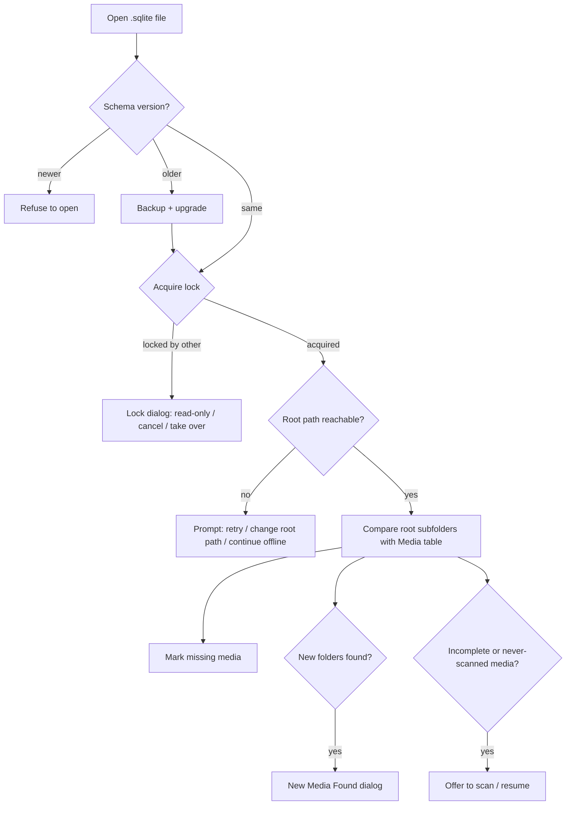
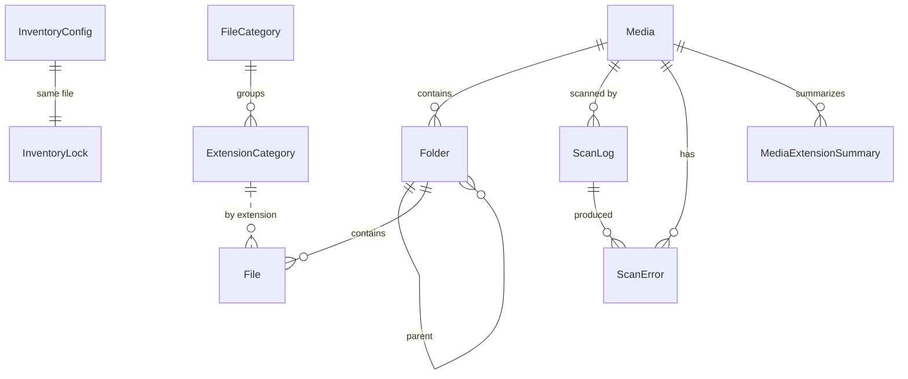

# 001 – Initial Requirements: Accession (Media Inventory for eDiscovery)

| Item | Value |
|---|---|
| Document | 001-initial_requirements |
| Status | Draft – for review |
| Date | 2026-09-27 |
| Scope | Version 1.0 of the desktop application |

---

## 1. Purpose and Background

eDiscovery vendors receive data from many sources. Each delivery ("media") is assigned a **Media ID** and a copy is stored on a network share in a folder named after that Media ID, e.g.:

```
\\nas01\cases\ACME_2026-001\Media\
    123-123_001\
    123-123_002\
    123-123_003\
```

**Accession** is a Windows desktop application that scans these media folders and records every folder and file (with metadata and SHA-1 hash) into a single SQLite database file, called an **Inventory**. It provides a dashboard of totals by media, category and extension, and exports the inventory to Excel so it can be sent back to the party that produced the data.

The application is **read-only toward the evidence**: it must never modify source files or their metadata.

**Tagline** (shown on the Start window and About screen): *Inventory, hash, and report every media you receive.*

## 2. Glossary

| Term | Definition |
|---|---|
| **Inventory** | One SQLite database file (`*.sqlite`) holding everything about one matter's media. |
| **Root folder** | The single parent folder that directly contains all media folders of an inventory. Stored in `InventoryConfig.RootPath`. |
| **Media** | An immediate subfolder of the root folder. |
| **Media ID** | The media folder's name, whatever it is (`123-123_001`, `My Media`, …). No format is enforced. |
| **Relative path** | A path relative to the root folder, always starting with the Media ID, e.g. `\123-123_001\files\`. |
| **Scan** | Enumerating all folders/files of a media and hashing each file. |
| **Category** | An application-defined grouping of file extensions (Email, Chat, Spreadsheets, …). |
| **Lock** | A record in the inventory that marks it as in use by one user/machine. |

## 3. Scope

### 3.1 In scope (v1.0)
- Create / open / close inventories.
- Register media (manual selection and automatic discovery under the root folder).
- Multi-threaded scanning with SHA-1 hashing, pause / resume / cancel, and resume after restart.
- Rescan (replaces previous results) with scan history.
- Error logging (access denied, locked files, etc.).
- Dashboard: totals, per media, per category, per extension, duplicates, by year, largest files.
- File browser with filtering.
- Excel export.
- Single-user locking.
- Audit trail.
- Relocation (update the root path).

### 3.2 Out of scope (v1.0)
- Expanding containers (ZIP, PST, E01, etc.) – they are inventoried as single files.
- File-signature (magic byte) identification – classification is by extension only.
- De-NISTing / NSRL hash matching.
- Tracking media metadata that is managed in other systems (custodian, received date, chain of custody, etc.).
- User roles / permissions.
- Editing categories in the UI.
- Hidden / system / read-only attributes, owner/ACLs, alternate data streams.
- Multi-user concurrent editing.
- Non-Windows platforms.

## 4. Platform and Technology

| ID | Requirement |
|---|---|
| TECH-01 | Target **Windows 10 (22H2) and Windows 11, x64 only**. |
| TECH-02 | **C# / WPF** on **.NET 10 (LTS)**, published self-contained for `win-x64`. *(.NET 8 LTS support ends Nov 2026, so .NET 10 is recommended.)* |
| TECH-03 | Distributed as an **installed application** (MSI built with WiX Toolset). Installs per machine to `Program Files`, creates a Start-menu shortcut and associates nothing by default. |
| TECH-04 | Database access via `Microsoft.Data.Sqlite`. Recommended helpers: Dapper (queries), CommunityToolkit.Mvvm (MVVM), a streaming Excel writer (MiniExcel or Open XML SDK `OpenXmlWriter`), a WPF chart library (LiveCharts2 or ScottPlot), Serilog (application log). Final library choice is a design decision; all must have licences allowing commercial use. |
| TECH-05 | Application settings (per Windows user) stored in `%APPDATA%\Accession\settings.json`. Application log in `%LOCALAPPDATA%\Accession\logs\`. |
| TECH-06 | The application must support paths longer than 260 characters (UNC and local) – long paths are normal in eDiscovery data. |
| TECH-07 | Solution `Accession.sln` with projects `Accession.App` (WPF UI), `Accession.Core` (services, scanning, models – no UI references), `Accession.Data` (SQLite access) and `Accession.Tests`. Root namespace `Accession`. The repository name stays `minventory`. |

## 5. Functional Requirements

### 5.1 Inventory management

| ID | Requirement |
|---|---|
| INV-01 | **New Inventory**: the user enters **Client Name**, **Client ID**, **Matter Name**, **Matter ID** (all required), **Description** (optional), **Matter Link URL** (optional, must be `http`/`https` if entered), selects the **Root folder**, and chooses where to save the inventory file. |
| INV-02 | Default file name: `{ClientID}_{MatterID}_Inventory.sqlite` (invalid filename characters replaced with `_`). Default location: the root folder. |
| INV-03 | The inventory file **must not** be placed inside a media folder (it would be inventoried as evidence). If it is placed in the root folder, discovery ignores it (discovery only looks at folders). |
| INV-04 | Creating an inventory creates the SQLite file with **all tables**, writes the `InventoryConfig` row (root path, schema version, matter fields, creator, machine, timestamps, app version), seeds the category tables, acquires the lock, and writes an audit entry. |
| INV-05 | **Open Inventory**: via file dialog or a *Recent Inventories* list (stored in user settings; missing files are shown greyed out with an option to remove). |
| INV-06 | On open the application runs the **Open sequence** (section 5.3). |
| INV-07 | **Inventory Properties**: matter fields and Matter Link URL can be edited after creation. Each change is audited with old and new values. |
| INV-08 | **Matter Link**: when a URL is set, a *Open Matter* button/link opens it in the default browser. |
| INV-09 | **Relocate (Change Root Path)**: the user can change `RootPath`. The app validates that the new path exists and warns if any registered media folder is not found under it (lists them), then asks for confirmation. No rescan is needed because all stored paths are relative. Audited with old/new path. |
| INV-10 | **Close Inventory**: waits for / asks to pause any running scan, releases the lock, writes an audit entry. Closing the app does the same. |
| INV-11 | **Schema version**: `InventoryConfig.SchemaVersion` is an integer (starts at `1`). On open: equal → open; older → offer upgrade (a backup copy `<name>.v<old>.<yyyyMMddHHmmss>.bak` is made first, then migrations run in a transaction, audited); newer → refuse to open with a message to update the application. |

### 5.2 Locking (single user)

| ID | Requirement |
|---|---|
| LCK-01 | Only one user/app instance may have an inventory open for writing. This is enforced with the `InventoryLock` table (single row). |
| LCK-02 | On open the app acquires the lock inside a `BEGIN IMMEDIATE` transaction: if unlocked, or already locked by the same session, it writes user (`DOMAIN\user`), machine name, process ID, session GUID, and lock/heartbeat timestamps. |
| LCK-03 | While open, the app updates `HeartbeatAtUtc` every 60 seconds. |
| LCK-04 | If the inventory is locked by someone else, show a dialog with who/where/since/last heartbeat and options: **Open Read-Only**, **Cancel**, and – only if the heartbeat is older than 10 minutes (stale) – **Take Over Lock**. Taking over is confirmed and audited (`LockForced`) with the previous holder's details. |
| LCK-05 | **Read-only mode** allows Dashboard, File browser, Errors, Audit log and Export. All modifying actions are disabled and the title bar shows "READ-ONLY". |
| LCK-06 | The lock is released on close, including normal app exit. After a crash the lock becomes stale and can be taken over per LCK-04. |
| LCK-07 | **Own lock after a crash:** if the lock holder is the same user on the same computer and its process is no longer a running Accession, the session was not closed properly. The lock is taken back without asking, audited (`LockRecovered`) with the old holder's details, and the inventory opens normally with a notice: "The last session on this computer was not closed properly". If that Accession process is still running (another window), the user is told the inventory is already open in another window and may open it read-only (no take over). |

### 5.3 Open sequence and media discovery



| ID | Requirement |
|---|---|
| DSC-01 | On open (and on demand via *Refresh / Discover*), list the **immediate subfolders** of the root folder and compare them (case-insensitive) with registered, non-deleted media. |
| DSC-02 | Subfolders not registered → **New Media Found** dialog listing them with checkboxes, options *Add selected*, *Add & scan selected*, *Not now*. Folders belonging to previously deleted media are marked "previously deleted". |
| DSC-03 | Registered media whose folder no longer exists → status **Missing** (shown with a warning icon). Data is kept. Status returns to its previous value when the folder reappears. |
| DSC-04 | Media with status **New** (never scanned) or **Incomplete** (interrupted/cancelled) → notification offering *Scan now* / *Resume now* / *Later*. |
| DSC-05 | Discovery ignores `$RECYCLE.BIN` and `System Volume Information` at the root level only. Inside media folders everything is scanned. |
| DSC-06 | If the root path is unreachable, the user can retry, change the root path (INV-09) or continue offline (dashboard, browse, export work; scanning disabled). |

### 5.4 Media management

| ID | Requirement |
|---|---|
| MED-01 | **Add Media**: the user picks one or more folders, from the discovered list or via folder browser. |
| MED-02 | A selected folder must be an **immediate child of the root folder**. Anything else is rejected with an explanation (e.g. `\abc\media1` when the root is `\def\`). |
| MED-03 | The Media ID is the folder name as it appears on disk. Media IDs are unique (case-insensitive) among non-deleted media. |
| MED-04 | Adding a media creates a `Media` row with status **New** and writes an audit entry. If *Add & scan* was chosen, it is queued for scanning. |
| MED-05 | **Delete Media**: requires confirmation (the user types the Media ID). It is not allowed while the media is scanning or queued (cancel first). All its `Folder`, `File`, `ScanError` and summary rows are deleted; the `Media` row is marked deleted (`IsDeleted=1`, `DeletedAtUtc`, `DeletedBy`). **ScanLog and AuditLog entries are kept.** |
| MED-06 | A deleted media's folder can be added again; this creates a new `Media` row. |
| MED-07 | *Open in Explorer* opens the media folder (read-only action, no audit). |

**Media statuses:** `New`, `Queued`, `Scanning` (enumerating), `Hashing`, `Paused`, `Completed`, `CompletedWithErrors`, `Incomplete`, `Missing`.

### 5.5 Scanning

#### 5.5.1 General

| ID | Requirement |
|---|---|
| SCN-01 | The user selects one or more media and chooses **Scan** (never scanned / incomplete) or **Rescan** (completed). Selected media are added to the **scan queue**. Scans run in the background; queueing (also from *Add media* with "Start scanning") happens off the UI thread in one database transaction, and the screens reload once per burst of status changes, so the app stays responsive while scanning. |
| SCN-02 | Media are scanned **one after another** (FIFO). Within a media, work is **multi-threaded** (see 5.5.3). The queue can be reordered and items removed before they start. |
| SCN-03 | **Rescan replaces previous results**: at the start of a full scan, all `Folder`, `File`, `ScanError` and summary rows of the media are deleted, then the scan runs. Confirmation required when data exists. |
| SCN-04 | Every scan run (full or resume) is recorded in `ScanLog` with start/end time, user, machine, app version, thread settings, outcome and counts. `Media.ScanCount` counts full scans. |
| SCN-05 | **Pause / Resume / Cancel** are available for the running scan. *Pause* stops starting new work and lets in-flight files finish. *Cancel* stops and leaves the media **Incomplete** (resumable). |
| SCN-06 | **Resume after interruption** (cancel, crash, network loss, app closed): Incomplete media can be resumed, continuing from where it stopped (see 5.5.4) without re-hashing completed files. |
| SCN-07 | **Network loss** during a scan: after 3 retries with back-off (5 s, 15 s, 45 s), the scan is paused automatically and the user is notified. |
| SCN-08 | The scan must not block the UI. Progress refreshes at least once per second. |
| SCN-09 | Scan and hash processing continues while the user browses the dashboard or other screens (data shown may be partial and is marked "scan in progress"). |

#### 5.5.2 What is captured

| ID | Requirement |
|---|---|
| SCN-10 | **Folders** (including empty ones and the media folder itself): name, relative path, parent, created / modified / accessed timestamps. |
| SCN-11 | **Files**: name, extension, relative folder, size in bytes, created / modified / accessed timestamps, **SHA-1** (40-char lowercase hex). |
| SCN-12 | Timestamps are stored in **UTC**. |
| SCN-13 | **Extension** = text after the last `.` in the file name, lowercase, without the dot (same rule as .NET `Path.GetExtension`). No dot → empty string. |
| SCN-14 | Relative paths start with `\<MediaID>\` and end with `\` for folders, e.g. `\123-123_001\files\`. Stored as found on disk (case preserved); compared case-insensitively. |
| SCN-15 | Paths over 260 characters are scanned normally. |
| SCN-16 | Reparse points (symbolic links, junctions, mount points) are **recorded but not followed**, to avoid loops and scanning data outside the media. A `ScanError` entry of type `ReparsePointSkipped` (severity Info) is logged. |

#### 5.5.3 Process and performance

| ID | Requirement |
|---|---|
| SCN-20 | **Phase 1 – Enumeration**: folders are enumerated in parallel (default **4** threads, configurable 1–16). File metadata is read from the directory listing (no file open needed). |
| SCN-21 | **Phase 2 – Hashing**: files with a pending hash are hashed by a worker pool (default **4** threads, configurable 1–32), streaming with a 1 MB buffer. Hashing may start while enumeration is still running. |
| SCN-22 | All database writes go through **one writer** that commits in batches (default 10,000 rows or 2 seconds, whichever comes first), and as soon as no rows have come for 200 ms, so an idle batch never holds the write lock. |
| SCN-23 | Must support **10 million+ files per inventory** without degrading the UI. Grids use UI virtualization and paged queries. |
| SCN-24 | Progress shows: current media, phase, folders/files found, files hashed / total, bytes hashed / total, throughput (files/s, MB/s), elapsed time, ETA, errors so far. |
| SCN-25 | At the end of a scan the app computes summary data (per media and per extension counts and bytes), updates `Media` totals and status (`Completed`, or `CompletedWithErrors` if errors exist), and closes the `ScanLog` entry. |

#### 5.5.4 Resume logic

| ID | Requirement |
|---|---|
| SCN-30 | Each folder has an `IsEnumerated` flag set in the same transaction as its file rows. On resume, file rows of folders not flagged are deleted and those folders are enumerated again. |
| SCN-31 | Each file has a `HashStatus` (`0 Pending`, `1 Hashed`, `2 Error`, `3 Skipped` for file reparse points, which are never read). On resume, only `Pending` files are hashed. `Error` files are retried only on a rescan or via *Retry failed files*. |

#### 5.5.5 Evidence preservation (read-only)

| ID | Requirement |
|---|---|
| SCN-40 | Source files and folders are opened **read-only** (`FileAccess.Read`, share mode `Read \| Write \| Delete` so other programs are not blocked). The app never writes, renames, moves or deletes anything under the root folder. |
| SCN-41 | Timestamps are captured from the directory listing **before** the file is opened for hashing. |
| SCN-42 | Opening a file to hash it can update its last-accessed time on some file systems. When the handle allows it, the app requests that the access time not be updated (`SetFileTime` with `0xFFFFFFFF`). If that is not possible (e.g. read-only share permissions), the recorded value is still the one captured before hashing. This limitation is shown in the About/Help text. |
| SCN-43 | If a file's size or modified time changes between enumeration and the end of hashing, a `ScanError` of type `ChangedDuringScan` is logged (the hash is still stored). |

#### 5.5.6 Errors

| ID | Requirement |
|---|---|
| SCN-50 | Errors are logged to `ScanError` with media, scan ID, relative path, item type (Folder/File), error type, Win32/HRESULT code, message and time. The scan continues. |
| SCN-51 | Error types: `AccessDenied`, `FileLocked` (sharing violation), `NotFound`, `PathError`, `IOError`, `ChangedDuringScan`, `ReparsePointSkipped` (Info), `Other`. |
| SCN-52 | An access-denied folder is recorded in the `Folder` table (when its metadata can be read), with its contents unknown, plus an error row. A locked or unreadable file is recorded in `File` with `HashStatus = 2`, plus an error row. |
| SCN-53 | Errors are visible on the **Errors** screen and counted on the Dashboard and Media list. They are included in the Excel export. |

### 5.6 File categories

| ID | Requirement |
|---|---|
| CAT-01 | Categories and their extension mappings are **defined by the application** and seeded into every new inventory (`FileCategory`, `ExtensionCategory`). |
| CAT-02 | There is **no UI to edit categories**. A read-only *Categories* screen shows categories and their extensions. (Users with direct SQLite access could edit the tables; the app does not prevent or support that.) |
| CAT-03 | A file's category is determined **at query time** by joining its extension to `ExtensionCategory`. Unmapped extensions → **Other / Unknown**; empty extension → **No Extension**. Because nothing is stored on `File`, a new app version can update the mappings through a schema migration without rescanning. |
| CAT-04 | Numbered split-part extensions (`e01`–`e99`, `ex01`…, `l01`–`l99`, `001`–`999`) map to **Forensic Images**. They are seeded as explicit rows. |
| CAT-05 | The proposed category list is in **Appendix A**. |

### 5.7 Dashboard

| ID | Requirement |
|---|---|
| DSH-01 | **Summary tiles**: Total Media, Total Folders, Total Files, Total Size, Hashed files (% complete), Unique Files (distinct SHA-1), Duplicate Files and Duplicate Size, Errors. |
| DSH-02 | **Media filter**: All media (default) or a multi-selection. All dashboard sections respect the filter, except the By Media table, which always lists every media with a checkbox to select it (unselected media dimmed). The filter list also offers Select all / Unselect all (of the media shown), a Media ID search and "Only" per media. With no media selected the page says so instead of showing empty sections. Changes reload the dashboard after a short pause (about 0.3 s), so several quick ticks reload once. The selection lasts while the inventory is open. |
| DSH-03 | **By Media** grid: Media ID, status, folders, files, size, hashed %, duplicates within media, errors, last scanned, scan count. |
| DSH-04 | **By Category**: category, file count, size, % of files, % of size, plus a bar or donut chart. Selecting a category shows its extensions. |
| DSH-05 | **By Extension**: extension, category, file count, size, % of size. Sortable and searchable. |
| DSH-06 | **Duplicates** (by SHA-1, hashed files only): within each media and across media. Unique size = size counting each hash once; duplicate size = total hashed size − unique size. Files not yet hashed are excluded and the tile says so. |
| DSH-07 | **By Year** (modified date): file count and size per year. |
| DSH-08 | **Largest Files**: top 100 by size (Media ID, relative path, size, modified). |
| DSH-09 | Clicking a row (media, category, extension, year) opens the **File browser** with that filter applied, together with the dashboard's media selection (one media or several). |
| DSH-10 | Dashboard data is produced by **named SQL query sets** kept separate from the UI code (embedded resource files, one query per widget) so they can be replaced by the SQL queries the business owner will provide. The queries in this document are placeholders. |
| DSH-11 | Dashboard must load in **≤ 3 seconds for 10M files** for the summary tiles, By Media, By Category and By Extension sections, using the summary tables filled at scan end (SCN-25). Duplicates, By Year and Largest Files may load in the background with a busy indicator. |
| DSH-12 | Sizes are shown in the unit chosen in settings (section 5.11). |

### 5.8 File browser

| ID | Requirement |
|---|---|
| BRW-01 | Left: folder tree (Media → folders), loaded lazily. Right: virtualized file grid. |
| BRW-02 | Columns: Media ID, Name, Extension, Category, Relative Path, Size, Created, Modified, Accessed, SHA-1, Hash Status, Duplicate count. Columns can be shown/hidden and sorted. |
| BRW-03 | Filters: media and folder in the tree (with/without subfolders), category, extension, size range, modified date range, hash status, "duplicates only", name contains, exact SHA-1. |
| BRW-04 | Right-click menu on files (also the menu key / Shift+F10): *Copy SHA-1*, *Copy path* (full path), *Copy file name*, *Show in folder* (Explorer), *Find all copies*, *Filter by this extension*, *Add to saved search*, *Copy To…* (CPY-09). Right-clicking a ticked row acts on all ticked rows (the menu says "N ticked files"); any other row is selected and acts alone; several values are copied one per line. The row buttons stay. The app never opens or launches the file itself. |
| BRW-07 | Right-click menu on a media or folder in the tree: *Open in Explorer* (a notice if the folder cannot be reached), *Copy folder path*, *Copy this folder…* (Copy files for the folder and its subfolders, other filters not applied), *Export this folder…*. The help warns that browsing the evidence in Explorer can write Thumbs.db/desktop.ini and update access times. |
| BRW-05 | *Export current view* sends the filtered result to Excel (section 5.9). |
| BRW-06 | The view has one **location**: a media or folder in the **Media** tab's tree, a saved search, or the Dashboard's media selection. Choosing another location replaces it; the other filters (category, extension, name, size, dates, hash status, duplicates, errors, SHA-1) stay, so a Dashboard click-through can be narrowed folder by folder. *Browse files* (Media screen, Dashboard) selects the media in the tree. Each applied filter is shown as a chip with its own ×; *Clear all* removes everything. |

### 5.8a Saved searches

| ID | Requirement |
|---|---|
| SAV-01 | A **saved search** is a named, fixed list of files kept in the inventory (shared by everyone who opens it): **Name** (required, unique ignoring case, at most 100 characters) and optional **Description**. It records who created it, on which computer and when, and the same for the last change (schema v3); the open saved search shows "Created by … on …, date", and the edit dialog shows both. |
| SAV-02 | The Files screen's left panel has two tabs: **Folders** (the folder tree) and **Saved searches** (each with its file count and total size; description as tooltip). Saved searches can be created, renamed/edited and deleted (deleting asks first and never touches the files). |
| SAV-03 | Files are added with **Add to saved search**: *all results* (every file matching the current filters, on all pages) or the *ticked rows*, into an existing saved search or a new one. Files already in the list are skipped. |
| SAV-04 | Clicking a saved search shows its files; the filters narrow within it. While one is shown, *Remove ticked* and *Remove all results* take files out of it. *Export current view* exports exactly its (filtered) files. |
| SAV-05 | Files are remembered by media, folder path and file name, so they stay in a saved search after a rescan. Deleting a media removes its files from saved searches. |
| SAV-06 | Changes are audited (created, changed, deleted, files added/removed with counts). A read-only inventory shows saved searches but cannot change them. Saved searches need schema v2; older inventories are upgraded (with a backup) when opened. |

### 5.8b Copying files

| ID | Requirement |
|---|---|
| CPY-01 | The Files screen's **Copy** menu offers **Generate copy batch…** and **Copy files…** for the *ticked rows* or *all results* (every file matching the current filters, on all pages). |
| CPY-02 | Naming: **keep the original folders and names** (`<destination>\<Media ID>\<folders>\<name>`) **sequential names** `<prefix><number>.<ext>` with a chosen prefix, number of digits (1–15) and first number; files are numbered in Media ID, folder, name order (case-insensitive); the extension keeps its case and a file without one gets no dot. A range that does not fit in the digits is refused. Or **SHA-1 names** (CPY-09). |
| CPY-03 | Files already at the destination are **skipped** and reported, never overwritten. |
| CPY-04 | Nothing is written under the root: the destination, the batch file and the manifest cannot be the root or inside it. Source files are only read (SCN-40, SCN-42). |
| CPY-05 | **Copy batch**: a `.bat` file (UTF-8, `chcp 65001`) with one command per file from a template: presets **copy** (`copy /Y {source} {destination} >nul`) and **robocopy** (keeps names only, so it is refused with sequential names), or a custom command. Placeholders `{source}`, `{destination}`, `{sourcedir}`, `{sourcename}`, `{destdir}`, `{destname}`; unquoted placeholders are quoted and `%` is doubled. The batch creates folders, skips existing files, counts copied, skipped and failed files (robocopy fails at exit code 8) and exits with 1 when any failed. On cancel or error no batch file is kept. |
| CPY-06 | **Copy files** copies in the background with progress and Cancel. **Preserve metadata** (default on): created, modified and accessed times and attributes of files, and the times of the folders it creates; no ACLs. **Verify** (default off): reads each copy back and compares its SHA-1 with the bytes read from the source; a mismatch deletes the copy and counts as failed. A file that cannot be read fails and the copy goes on. Cancel keeps the files already copied. The result shows copied, verified, skipped, failed and not reached. |
| CPY-07 | Both write a **CSV manifest** (UTF-8 with BOM): number, new path, original path, Media ID, size in bytes, modified (UTC), SHA-1 from the inventory, outcome (*In batch*, *Copied*, *Verified*, *Skipped*, *Failed*) and message; a cancelled copy ends with a *Stopped* row. A verified file whose SHA-1 differs from the inventory is noted. |
| CPY-08 | Each batch (`CopyBatchGenerated`) and copy (`FilesCopied`) is audited with the scope, destination, naming, command or options, counts and file paths; on a read-only inventory the audit entry is written when the file allows it. Large selections (millions of files) run in constant memory apart from the list of file IDs. |
| CPY-09 | **SHA-1 names**: flat, `<destination>\<sha1>_<name>` (SHA-1 lowercase, the name with its extension). In the app each file is written under a temporary name while its SHA-1 is computed, then renamed, so files not hashed yet or changed since the scan are named by their actual content (a change is noted in the manifest); a file with the same SHA-1 and name is copied once. A batch leaves out files without a SHA-1 (manifest: *Not in batch*) and cannot use robocopy. **Copy To…** (right-click on files) copies the right-clicked or ticked files this way: destination, preserve metadata, verify and manifest (copied, skipped, failed). |

### 5.9 Excel export

| ID | Requirement |
|---|---|
| EXP-01 | Export to `.xlsx` for delivery to the producing party. Scope: selected media or all media, or the current File browser view. |
| EXP-02 | Workbook sheets: **Summary** (matter info, root path, export date/user, totals, size unit), **Media** (per media totals and last scan date), **Categories**, **Extensions**, **Files**, **Errors**. The user can untick sheets. |
| EXP-03 | **Files** columns: Media ID, Relative Path, File Name, Extension, Category, Size (bytes), Size (MB) (a number: bytes ÷ 1,000,000, no unit in the cells; "Size (MiB)", bytes ÷ 1,048,576, when Settings uses binary units), Created (UTC), Modified (UTC), Accessed (UTC), SHA-1. |
| EXP-04 | Excel allows 1,048,576 rows per sheet. Larger file lists are split into sheets `Files (1)`, `Files (2)`, … Optionally (setting) split into one workbook per media. |
| EXP-05 | The export must stream rows (constant memory) so that 10M+ rows can be exported without running out of memory. It runs in the background with progress and cancel. |
| EXP-06 | Each export is audited (scope, sheets, row counts, output path). |

### 5.10 Audit trail

| ID | Requirement |
|---|---|
| AUD-01 | Every significant action is written to `AuditLog`: time (UTC), Windows user (`DOMAIN\user`), machine, action, Media ID (if relevant), details (JSON). |
| AUD-02 | Actions: `InventoryCreated`, `InventoryOpened`, `InventoryOpenedReadOnly`, `InventoryClosed`, `LockAcquired`, `LockReleased`, `LockForced`, `SchemaUpgraded`, `ConfigUpdated`, `RootPathChanged`, `MediaAdded`, `MediaDeleted`, `ScanQueued`, `ScanStarted`, `ScanPaused`, `ScanResumed`, `ScanCancelled`, `ScanCompleted`, `ScanFailed`, `ExportCreated`. |
| AUD-03 | The app never updates or deletes audit rows (media deletion keeps them). |
| AUD-04 | *Audit Log* screen: read-only, filterable grid (date range, action, user, media); exportable to Excel. |

### 5.11 Application settings (per Windows user)

| Setting | Default | Notes |
|---|---|---|
| Size unit | **GB (decimal, 10⁹)** | Options: decimal (KB/MB/GB/TB) or binary (KiB/MiB/GiB/TiB). Applies to UI and export. Database always stores bytes. |
| Display time zone | Local | Local or UTC for the UI. Exports are always UTC. |
| Enumeration threads | 4 | 1–16 |
| Hashing threads | 4 | 1–32 |
| DB batch size | 10,000 | Advanced |
| Default export folder | Documents | |
| Split export per media | Off | |
| Recent inventories | — | Up to 15 |

## 6. Non-Functional Requirements

| ID | Requirement |
|---|---|
| NFR-01 | **Scale**: 10M+ files and 100+ media per inventory. |
| NFR-02 | **Responsiveness**: the UI thread never runs I/O or DB queries; any operation over 300 ms shows a busy indicator; long operations can be cancelled. |
| NFR-03 | **Durability**: the database stays consistent after a crash or power loss (transactions; resume per 5.5.4). |
| NFR-04 | **SQLite on network shares**: use `journal_mode=DELETE` (WAL is not safe over SMB), `synchronous=FULL`, `foreign_keys=ON`, `page_size=8192` (set at creation). Keep write transactions batched. An inventory left with an interrupted write (hot journal, e.g. the app or computer stopped during a scan) is recovered when it is next opened, even read-only: the file is opened read-write once so SQLite rolls the journal back (only the last committed state is kept). If the file cannot be written, opening explains that someone with write access must open it once. |
| NFR-05 | **Evidence integrity**: no writes under the root folder (SCN-40). Verified by an automated test that compares timestamps and hashes before and after a scan. |
| NFR-06 | **Hash correctness**: SHA-1 verified against known test vectors and a reference tool on a test data set. |
| NFR-07 | **Logging**: application log (Serilog, rolling daily, 30 days) for diagnostics, separate from the audit trail. No evidence content is logged. |
| NFR-08 | **Accessibility / UX**: keyboard navigation, resizable windows, remembers window size/position and grid column layouts, 100–200% DPI scaling. |
| NFR-09 | **Installer**: MSI, x64, per-machine; upgrade in place; no admin rights needed to run. |
| NFR-10 | **Testability**: scanning, DB and export logic live in a UI-independent class library with unit/integration tests. |

## 7. Data Model (Schema Version 1)

### 7.1 Conventions
- All timestamps are **UTC ISO-8601 text** `yyyy-MM-ddTHH:mm:ss.fffffffZ` (readable, sortable, works with SQLite date functions and user-written SQL).
- Sizes are `INTEGER` bytes.
- Path and name columns use `COLLATE NOCASE`.
- `Media.MediaKey` is the internal integer key; `Media.MediaId` is the folder name (the business "Media ID").

### 7.2 Entity relationship



### 7.3 DDL

```sql
-- One row. Inventory identity, matter info and root location.
CREATE TABLE InventoryConfig (
    ConfigId            INTEGER PRIMARY KEY CHECK (ConfigId = 1),
    InventoryGuid       TEXT    NOT NULL,
    SchemaVersion       INTEGER NOT NULL,
    RootPath            TEXT    NOT NULL,          -- e.g. \\nas01\cases\ACME_2026-001\Media
    ClientName          TEXT    NOT NULL,
    ClientCode          TEXT    NOT NULL,          -- "Client ID"
    MatterName          TEXT    NOT NULL,
    MatterCode          TEXT    NOT NULL,          -- "Matter ID"
    Description         TEXT,
    MatterUrl           TEXT,
    CreatedAtUtc        TEXT    NOT NULL,
    CreatedBy           TEXT    NOT NULL,
    CreatedOnMachine    TEXT    NOT NULL,
    CreatedAppVersion   TEXT    NOT NULL,
    LastOpenedAtUtc     TEXT,
    LastOpenedBy        TEXT,
    LastDbPath          TEXT                       -- where the .sqlite file was last opened from
);

-- Applied schema migrations.
CREATE TABLE SchemaMigration (
    Version             INTEGER PRIMARY KEY,
    AppliedAtUtc        TEXT    NOT NULL,
    AppliedBy           TEXT    NOT NULL,
    AppVersion          TEXT    NOT NULL
);

-- One row. Single-user lock.
CREATE TABLE InventoryLock (
    LockId              INTEGER PRIMARY KEY CHECK (LockId = 1),
    IsLocked            INTEGER NOT NULL DEFAULT 0,
    LockedBy            TEXT,
    MachineName         TEXT,
    ProcessId           INTEGER,
    SessionGuid         TEXT,
    LockedAtUtc         TEXT,
    HeartbeatAtUtc      TEXT
);

CREATE TABLE Media (
    MediaKey            INTEGER PRIMARY KEY,
    MediaId             TEXT    NOT NULL COLLATE NOCASE,   -- folder name
    RelativePath        TEXT    NOT NULL COLLATE NOCASE,   -- \123-123_001\
    Status              TEXT    NOT NULL,                  -- see 5.4
    StatusBeforeMissing TEXT,                              -- restored when a Missing folder reappears (DSC-03)
    AddedAtUtc          TEXT    NOT NULL,
    AddedBy             TEXT    NOT NULL,
    ScanCount           INTEGER NOT NULL DEFAULT 0,
    LastScanStartedUtc  TEXT,
    LastScanCompletedUtc TEXT,
    FolderCount         INTEGER NOT NULL DEFAULT 0,
    FileCount           INTEGER NOT NULL DEFAULT 0,
    TotalBytes          INTEGER NOT NULL DEFAULT 0,
    HashedCount         INTEGER NOT NULL DEFAULT 0,
    ErrorCount          INTEGER NOT NULL DEFAULT 0,
    IsDeleted           INTEGER NOT NULL DEFAULT 0,
    DeletedAtUtc        TEXT,
    DeletedBy           TEXT
);
CREATE UNIQUE INDEX UX_Media_MediaId_Active ON Media (MediaId) WHERE IsDeleted = 0;

CREATE TABLE Folder (
    FolderId            INTEGER PRIMARY KEY,
    MediaKey            INTEGER NOT NULL REFERENCES Media (MediaKey),
    ParentFolderId      INTEGER REFERENCES Folder (FolderId),  -- NULL for the media folder
    Name                TEXT    NOT NULL COLLATE NOCASE,
    RelativePath        TEXT    NOT NULL COLLATE NOCASE,       -- \123-123_001\files\
    CreatedUtc          TEXT,
    ModifiedUtc         TEXT,
    AccessedUtc         TEXT,
    IsReparsePoint      INTEGER NOT NULL DEFAULT 0,
    IsEnumerated        INTEGER NOT NULL DEFAULT 0            -- resume support
);
CREATE UNIQUE INDEX UX_Folder_Media_Path ON Folder (MediaKey, RelativePath);
CREATE INDEX IX_Folder_Parent ON Folder (ParentFolderId);

CREATE TABLE File (
    FileId              INTEGER PRIMARY KEY,
    MediaKey            INTEGER NOT NULL REFERENCES Media (MediaKey),
    FolderId            INTEGER NOT NULL REFERENCES Folder (FolderId),
    Name                TEXT    NOT NULL COLLATE NOCASE,
    Extension           TEXT    NOT NULL COLLATE NOCASE,      -- lowercase, no dot, '' if none
    SizeBytes           INTEGER NOT NULL,
    CreatedUtc          TEXT,
    ModifiedUtc         TEXT,
    AccessedUtc         TEXT,
    Sha1                TEXT,                                 -- 40 lowercase hex chars
    HashStatus          INTEGER NOT NULL DEFAULT 0,           -- 0 Pending, 1 Hashed, 2 Error, 3 Skipped (reparse point)
    HashedAtUtc         TEXT
);
CREATE INDEX IX_File_Folder        ON File (FolderId);
CREATE INDEX IX_File_Media_Ext     ON File (MediaKey, Extension);
CREATE INDEX IX_File_Sha1          ON File (Sha1) WHERE Sha1 IS NOT NULL;
CREATE INDEX IX_File_Media_Pending ON File (MediaKey) WHERE HashStatus = 0;
CREATE INDEX IX_File_Size          ON File (SizeBytes);

CREATE TABLE ScanLog (
    ScanId              INTEGER PRIMARY KEY,
    MediaKey            INTEGER NOT NULL REFERENCES Media (MediaKey),
    MediaId             TEXT    NOT NULL,                     -- copy, kept for history
    ScanType            TEXT    NOT NULL,                     -- Full | Resume | RetryFailed
    StartedAtUtc        TEXT    NOT NULL,
    EndedAtUtc          TEXT,
    Outcome             TEXT,                                 -- Completed | CompletedWithErrors | Cancelled | Paused | Failed | Interrupted
    UserName            TEXT    NOT NULL,
    MachineName         TEXT    NOT NULL,
    AppVersion          TEXT    NOT NULL,
    EnumThreads         INTEGER NOT NULL,
    HashThreads         INTEGER NOT NULL,
    FolderCount         INTEGER,
    FileCount           INTEGER,
    TotalBytes          INTEGER,
    HashedCount         INTEGER,
    ErrorCount          INTEGER,
    Notes               TEXT
);
CREATE INDEX IX_ScanLog_Media ON ScanLog (MediaKey);

CREATE TABLE ScanError (
    ErrorId             INTEGER PRIMARY KEY,
    MediaKey            INTEGER NOT NULL REFERENCES Media (MediaKey),
    ScanId              INTEGER REFERENCES ScanLog (ScanId),
    RelativePath        TEXT    NOT NULL COLLATE NOCASE,
    ItemType            TEXT    NOT NULL,                     -- Folder | File
    ErrorType           TEXT    NOT NULL,                     -- see SCN-51
    Severity            TEXT    NOT NULL DEFAULT 'Error',     -- Error | Warning | Info
    ErrorCode           INTEGER,                              -- Win32 / HRESULT
    Message             TEXT,
    OccurredAtUtc       TEXT    NOT NULL
);
CREATE INDEX IX_ScanError_Media ON ScanError (MediaKey);

-- Application-defined categories (seeded, not editable in the UI).
CREATE TABLE FileCategory (
    CategoryId          INTEGER PRIMARY KEY,
    Name                TEXT    NOT NULL UNIQUE,
    Description         TEXT,
    SortOrder           INTEGER NOT NULL
);

CREATE TABLE ExtensionCategory (
    Extension           TEXT    PRIMARY KEY COLLATE NOCASE,   -- lowercase, no dot
    CategoryId          INTEGER NOT NULL REFERENCES FileCategory (CategoryId)
);

-- Filled at the end of each scan; drives the dashboard.
CREATE TABLE MediaExtensionSummary (
    MediaKey            INTEGER NOT NULL REFERENCES Media (MediaKey),
    Extension           TEXT    NOT NULL COLLATE NOCASE,
    FileCount           INTEGER NOT NULL,
    TotalBytes          INTEGER NOT NULL,
    PRIMARY KEY (MediaKey, Extension)
);

CREATE TABLE AuditLog (
    AuditId             INTEGER PRIMARY KEY,
    OccurredAtUtc       TEXT    NOT NULL,
    UserName            TEXT    NOT NULL,
    MachineName         TEXT    NOT NULL,
    Action              TEXT    NOT NULL,
    MediaId             TEXT,
    Details             TEXT                                  -- JSON
);
CREATE INDEX IX_AuditLog_Time ON AuditLog (OccurredAtUtc);
```

> `ClientCode`/`MatterCode` are the user-facing "Client ID"/"Matter ID". The `…Code` names avoid confusion with integer key columns.

### 7.4 Example placeholder query (category totals)

```sql
SELECT COALESCE(c.Name, CASE WHEN s.Extension = '' THEN 'No Extension' ELSE 'Other / Unknown' END) AS Category,
       SUM(s.FileCount)  AS Files,
       SUM(s.TotalBytes) AS Bytes
FROM MediaExtensionSummary s
JOIN Media m               ON m.MediaKey = s.MediaKey AND m.IsDeleted = 0
LEFT JOIN ExtensionCategory ec ON ec.Extension = s.Extension
LEFT JOIN FileCategory c       ON c.CategoryId = ec.CategoryId
GROUP BY 1
ORDER BY Bytes DESC;
```

## 8. User Interface

### 8.1 Screen map

```
Start Window
 ├─ New Inventory dialog
 ├─ Open Inventory (file dialog / recent list)
 │    └─ Lock Conflict dialog · Schema Upgrade prompt · Root Unreachable prompt
 └─ Main Window
      ├─ Dashboard
      ├─ Media            ─ Add Media dialog · Delete Media dialog · New Media Found dialog
      ├─ Files (browser)
      ├─ Scan Queue       ─ progress
      ├─ Errors
      ├─ Categories (read-only)
      ├─ Audit Log
      ├─ Inventory Properties dialog (matter info · root path)
      ├─ Export dialog
      └─ Settings dialog
```

### 8.2 Start window

```
┌──────────────────────────────────────────────────────────────┐
│  ACCESSION                                                   │
│  Inventory, hash, and report every media you receive.        │
│                                                              │
│   [ + New Inventory ]     [ Open Inventory... ]              │
│                                                              │
│   Recent inventories                                         │
│   ┌──────────────────────────────────────────────────────┐   │
│   │ ACME Corp – Smith v. ACME        2026-09-25 14:02    │   │
│   │ \\nas01\cases\ACME\Media\ACME_2026-001_Inventory...  │   │
│   │ Globex – Patent Review          2026-09-20 09:41    │   │
│   │ (file not found) \\nas02\...            [Remove]     │   │
│   └──────────────────────────────────────────────────────┘   │
│                                              [Settings]      │
└──────────────────────────────────────────────────────────────┘
```

### 8.3 New Inventory dialog

```
┌─ New Inventory ──────────────────────────────────────────────┐
│ Client Name *   [ACME Corporation                         ]  │
│ Client ID   *   [ACME                                     ]  │
│ Matter Name *   [Smith v. ACME                            ]  │
│ Matter ID   *   [2026-001                                 ]  │
│ Description     [                                         ]  │
│                 [                                         ]  │
│ Matter Link     [https://pm.example.com/matters/2026-001  ]  │
│                                                              │
│ Root Folder *   [\\nas01\cases\ACME\Media          ] [...]   │
│                 ✓ 12 subfolders found (candidate media)      │
│ Save As     *   [\\nas01\cases\ACME\Media\ACME_2026-001_Inventory.sqlite] [...] │
│                                                              │
│ [✓] Show discovered media after creating                     │
│                                       [ Create ]  [ Cancel ] │
└──────────────────────────────────────────────────────────────┘
```
Validation: required fields, valid URL, root exists, save location writable and not inside a media folder, file does not already exist (or confirm overwrite → not allowed if it is an inventory in use).

### 8.4 Main window shell

```
┌─ Accession – ACME Corporation / Smith v. ACME (2026-001) ────────────── [_][□][X] ┐
│ File  Inventory  Media  Scan  Export  Help                                         │
├───────────────┬────────────────────────────────────────────────────────────────────┤
│ ▣ Dashboard   │                                                                    │
│ ▤ Media   (12)│                    (selected screen content)                       │
│ ▥ Files       │                                                                    │
│ ⟳ Scan Queue 2│                                                                    │
│ ⚠ Errors  (37)│                                                                    │
│ ▦ Categories  │                                                                    │
│ ☰ Audit Log   │                                                                    │
│               │                                                                    │
│ [Open Matter ↗]│                                                                   │
├───────────────┴────────────────────────────────────────────────────────────────────┤
│ Root: \\nas01\cases\ACME\Media  │ Locked by CORP\jdoe on WS-114 │ Schema v1 │ Scanning 123-123_002 – Hashing 48% │
└────────────────────────────────────────────────────────────────────────────────────┘
```
Menus:
- **File**: New, Open, Close, Recent, Settings, Exit.
- **Inventory**: Properties, Change Root Path, Discover Media.
- **Media**: Add, Scan, Rescan, Resume, Delete, Open in Explorer.
- **Scan**: Pause, Resume, Cancel, Retry Failed Files.
- **Export**: Export to Excel.
- **Help**: About (app name, tagline, version, evidence-handling notes).

### 8.5 Dashboard

```
┌ Dashboard ─────────────────────────────────── Media: [All media ▼]  Units: GB  [⟳] ┐
│ ┌────────┐┌─────────┐┌───────────┐┌──────────┐┌──────────┐┌───────────┐┌────────┐│
│ │ Media  ││ Folders ││ Files     ││ Size     ││ Hashed   ││ Duplicates││ Errors ││
│ │   12   ││ 184,221 ││ 3,912,554 ││ 2,418 GB ││  97.2 %  ││ 612,004   ││   37   ││
│ │        ││         ││           ││          ││          ││ 311 GB    ││        ││
│ └────────┘└─────────┘└───────────┘└──────────┘└──────────┘└───────────┘└────────┘│
│ By Media                                                                         │
│ ┌ Media ID ────┬ Status ─────┬ Files ───┬ Size ────┬ Hashed ┬ Errors ┬ Scanned ─┐ │
│ │ 123-123_001  │ Completed   │ 1,204,113│  812 GB  │ 100 %  │    0   │ 09-24    │ │
│ │ 123-123_002  │ Hashing     │   988,420│  640 GB  │  48 %  │   12   │ running  │ │
│ │ My Media     │ New         │        — │      —   │   —    │    —   │ never    │ │
│ └──────────────┴─────────────┴──────────┴──────────┴────────┴────────┴──────────┘ │
│ By Category                         │ By Extension          [search      ]       │
│  Email        ████████████ 38%      │ ext   category      files     size         │
│  Spreadsheets ██████ 17%            │ msg   Email       1,020,331  402 GB        │
│  Images       █████ 14%             │ pdf   PDF           410,221  301 GB        │
│  ...                                │ ...                                         │
│ By Year (modified)                  │ Largest Files (top 100)                    │
│  ▁▂▃▅▇█▆▃  2012 … 2026              │ \123-123_001\backup\mail.pst   48.2 GB     │
└──────────────────────────────────────────────────────────────────────────────────┘
```
While a scan runs, a banner reads "Scan in progress – figures may be incomplete".

### 8.6 Media screen

```
┌ Media ─────────────────────────────────────────────────────────────────────────────┐
│ [+ Add Media] [Discover] [▶ Scan] [⟳ Rescan] [⏵ Resume] [🗑 Delete] [Explorer] [Export] │
│ ┌☐┬ Media ID ────┬ Status ──────────────┬ Folders┬ Files ───┬ Size ───┬ Hashed┬ Errors┬ Scans┬ Last Scanned ─────┐│
│ │☐│ 123-123_001  │ Completed            │ 12,004 │ 1,204,113│  812 GB │ 100 % │     0 │   2  │ 2026-09-24 18:12  ││
│ │☑│ 123-123_002  │ Hashing              │ 10,882 │   988,420│  640 GB │  48 % │    12 │   1  │ running           ││
│ │☐│ 123-123_003  │ ⚠ Missing            │  3,311 │   120,004│   41 GB │ 100 % │     0 │   1  │ 2026-09-10 11:02  ││
│ │☐│ My Media     │ New                  │      — │        — │      —  │   —   │     — │   0  │ never             ││
│ └─┴──────────────┴──────────────────────┴────────┴──────────┴─────────┴───────┴───────┴──────┴───────────────────┘│
│ Details: 123-123_002                                                                │
│  Path: \\nas01\cases\ACME\Media\123-123_002\   Added 2026-09-22 by CORP\jdoe        │
│  Scan history:  #7 Full   2026-09-27 08:01 → running        CORP\jdoe  WS-114       │
│                 #3 Full   2026-09-22 10:15 → Cancelled      CORP\jdoe  WS-114       │
└─────────────────────────────────────────────────────────────────────────────────────┘
```

### 8.7 Add Media / New Media Found dialog

```
┌─ Add Media ──────────────────────────────────────────────────┐
│ Root: \\nas01\cases\ACME\Media                               │
│ Folders under the root not yet in this inventory:            │
│  ☑ 123-123_004                                               │
│  ☑ 123-123_005                                               │
│  ☐ My Media            (previously deleted)                  │
│                                                              │
│ [Browse for folder...]   (must be directly under the root)   │
│                                                              │
│ [✓] Start scanning after adding                              │
│                        [ Add ]   [ Not now ]                 │
└──────────────────────────────────────────────────────────────┘
```
The same dialog appears automatically after opening an inventory when new folders are found (title "New Media Found").

### 8.8 Delete Media dialog

```
┌─ Delete Media ───────────────────────────────────────────────┐
│ ⚠ This removes all folder, file and error records for        │
│   123-123_003 (120,004 files) from this inventory.           │
│   Files on disk are NOT touched. Audit and scan history      │
│   are kept.                                                  │
│ Type the Media ID to confirm: [                ]             │
│                              [ Delete ]  [ Cancel ]          │
└──────────────────────────────────────────────────────────────┘
```

### 8.9 Scan Queue / Progress

```
┌ Scan Queue ──────────────────────────────────── [⏸ Pause] [⏵ Resume] [⏹ Cancel] ┐
│ Now scanning: 123-123_002                   Phase: Hashing  (enumeration done)  │
│ Folders 10,882   Files 988,420   Size 640 GB                                    │
│ Hashed  474,441 / 988,420 files   [██████████░░░░░░░░░░]  48 %                   │
│         307 GB / 640 GB   •  182 MB/s  •  1,410 files/s                          │
│ Elapsed 00:28:14   ETA 00:31:40   Errors 12   Threads: enum 4 / hash 4           │
│ Current: \123-123_002\Mail\archive\2019\box_03.pst                               │
│                                                                                 │
│ Queue                                                                           │
│  1. 123-123_004   Full scan   waiting      [↑][↓][✕]                            │
│  2. 123-123_005   Full scan   waiting      [↑][↓][✕]                            │
└─────────────────────────────────────────────────────────────────────────────────┘
```

### 8.10 Files browser

```
┌ Files ───────────────────────────────────────────────────────────────────────────────┐
│ Media [All ▼] Category [All ▼] Ext [    ] Size [   ]–[   ] Modified [    ]–[    ]      │
│ Name contains [          ] SHA-1 [                    ] ☐ Duplicates only ☐ Errors only │
│ ┌ Folders ────────────────┐┌ Name ──────────┬ Ext ┬ Category ┬ Size ──┬ Modified ────┬ SHA-1 ────────┐│
│ │▾ 123-123_001            ││ budget.xlsx    │xlsx │Spreadsh. │ 1.2 MB │2021-03-02 …  │ 3f7a…c91e     ││
│ │  ▾ files                ││ minutes.docx   │docx │Word Proc.│ 88 KB  │2021-03-04 …  │ 91bd…07aa (2) ││
│ │    ▸ Finance            ││ mail.pst       │pst  │Email     │ 4.1 GB │2022-11-30 …  │ (pending)     ││
│ │    ▸ HR                 ││ ...                                                                   ││
│ │▸ 123-123_002            │└───────────────────────────────────────────────────────────────────────┘│
│ └─────────────────────────┘ 1,204,113 files · 812 GB       [Export current view]                   │
└──────────────────────────────────────────────────────────────────────────────────────┘
```

### 8.11 Errors screen
Grid: Time, Media ID, Relative Path, Item Type, Error Type, Severity, Code, Message. Filters: media, error type, severity. Actions: *Retry failed files* (selected media), *Copy path*, *Export*.

### 8.12 Categories screen (read-only)
Left: list of categories with file counts in this inventory. Right: that category's extensions with counts. Note at top: "Categories are defined by the application."

### 8.13 Audit Log screen
Read-only grid: Time, User, Machine, Action, Media ID, Details. Filters: date range, action, user, media. Export.

### 8.14 Inventory Properties dialog
Tabs:
- **Matter**: editable Client Name / Client ID / Matter Name / Matter ID / Description / Matter Link.
- **Location**: current Root Path, *Change Root Path…* (validates and lists media not found under the new path), inventory file path (read-only).
- **Info** (read-only): Inventory GUID, schema version, created by/on/at, app version, current lock holder.

### 8.15 Export dialog

```
┌─ Export to Excel ────────────────────────────────────────────┐
│ Scope     (•) All media  ( ) Selected: [123-123_001, …  ▼]   │
│           ( ) Current Files view                             │
│ Sheets    ☑ Summary ☑ Media ☑ Categories ☑ Extensions        │
│           ☑ Files   ☑ Errors                                 │
│ Units     GB (decimal) – from Settings                       │
│ ☐ One workbook per media                                     │
│ Output    [C:\Users\jdoe\Documents\ACME_2026-001_Inventory_20260927.xlsx] [...] │
│ Estimated rows: 3,912,554 → 4 Files sheets                   │
│                                  [ Export ]  [ Cancel ]      │
└──────────────────────────────────────────────────────────────┘
```

### 8.16 Lock Conflict dialog

```
┌─ Inventory In Use ───────────────────────────────────────────┐
│ This inventory is open by CORP\asmith on WS-203              │
│ since 2026-09-27 07:55. Last activity: 2026-09-27 09:12.     │
│                                                              │
│ [ Open Read-Only ]  [ Take Over Lock ]*  [ Cancel ]          │
│ * only enabled when the last activity is > 10 minutes old    │
└──────────────────────────────────────────────────────────────┘
```

### 8.17 Settings dialog
Fields from section 5.11 grouped as **Display** (size unit, time zone), **Scanning** (threads, batch size) and **Export** (default folder, split per media).

## 9. Key Use Cases (acceptance scenarios)

1. **Create inventory and first scan**: create inventory → discovery shows 3 media → *Add & scan* → three media scanned in turn → dashboard shows totals equal to the sum of the three; `ScanLog` has 3 rows; audit shows created/added/scan events.
2. **New media arrives**: a new `123-123_004` folder is copied to the share → user opens inventory → "New Media Found" lists it → add & scan.
3. **Rescan**: rescan `123-123_001` → old rows replaced, `ScanCount` = 2, two `ScanLog` rows for that media.
4. **Interruption**: close app mid-hash → reopen → media shows Incomplete → Resume → only pending files hashed, final counts equal a clean full scan.
5. **Locked / denied files**: files open in another process and a folder with no permission → scan completes as `CompletedWithErrors`; errors listed; export's Errors sheet contains them.
6. **Relocation**: root and inventory moved to `\\nas02\...` → open → root unreachable prompt → change root path → all media found, no rescan.
7. **Second user**: another user opens the same inventory → lock dialog → read-only mode works; no writes possible.
8. **Delete media**: delete `123-123_003` → its folders/files gone, dashboard updated, scan/audit history remains, folder offered again in discovery as "previously deleted".
9. **Large export**: 3.9M files → workbook with 4 Files sheets, memory stays flat.
10. **Evidence integrity**: timestamps and hashes of a test data set are unchanged after scanning (checked by an independent tool).

## 10. Open Questions / Assumptions to Confirm

| # | Topic | Assumption made in this document |
|---|---|---|
| Q1 | Where the `.sqlite` usually lives | Default is the root folder; any location allowed except inside a media folder. Note: SQLite performance over SMB is lower than local disk; a local copy is not in scope. |
| Q2 | Read-only access for a second user | Allowed (dashboard, browse, export). Confirm, or block completely. |
| Q3 | Stale-lock takeover threshold | 10 minutes without heartbeat. |
| Q4 | Timestamp format in DB | UTC ISO-8601 text (readable for your own SQL). Alternative: integer ticks (smaller, ~0.7 GB less per 10M files). |
| Q5 | Export time zone | Always UTC. |
| Q6 | Dashboard SQL | To be provided by business owner; placeholders used (DSH-10). |
| Q7 | Last-access time | Best-effort preservation (SCN-42); captured value always taken before hashing. |
| Q8 | Root-level exclusions | `$RECYCLE.BIN`, `System Volume Information` ignored during discovery only. |
| Q9 | Chat category | Chat exports (Slack/Teams) are usually JSON/HTML and will be classified under Text/Web by extension; only dedicated formats such as `rsmf` map to Chat. |
| Q10 | App name | **Decided:** "Accession", tagline *"Inventory, hash, and report every media you receive."* |

---

## Appendix A – Proposed File Categories

| # | Category | Extensions |
|---|---|---|
| 1 | Email | pst, ost, msg, eml, emlx, mbox, mbx, nsf, olm, dbx, oft, p7m |
| 2 | Chat | rsmf |
| 3 | Calendar & Contacts | ics, ical, vcs, vcf |
| 4 | Word Processing | doc, docx, docm, dot, dotx, dotm, rtf, odt, ott, wpd, wps, pages, hwp, lwp |
| 5 | Spreadsheets | xls, xlsx, xlsm, xlsb, xlt, xltx, xltm, csv, tsv, ods, ots, numbers, wk1, wk3, wk4, wks, 123, qpw |
| 6 | Presentations | ppt, pptx, pptm, pps, ppsx, ppsm, pot, potx, potm, odp, otp, key |
| 7 | PDF & Fixed Layout | pdf, xps, oxps |
| 8 | Other Office Documents | one, onepkg, onetoc2, vsd, vsdx, vsdm, mpp, pub |
| 9 | Text & Web | txt, log, md, xml, json, yaml, yml, htm, html, mht, mhtml, css |
| 10 | Images | jpg, jpeg, jpe, png, gif, bmp, tif, tiff, heic, heif, webp, svg, ico, psd, ai, eps, emf, wmf, raw, cr2, cr3, nef, arw, dng, orf |
| 11 | Audio | mp3, wav, wma, m4a, aac, flac, ogg, oga, opus, aif, aiff, amr, mid, midi |
| 12 | Video | mp4, m4v, mov, avi, wmv, mkv, flv, webm, mpg, mpeg, 3gp, 3g2, mts, m2ts, vob, ts |
| 13 | Archives & Containers | zip, zipx, 7z, rar, tar, gz, tgz, bz2, xz, z, cab, iso, lzh, arj |
| 14 | Forensic Images | e01–e99, ex01, l01–l99, lx01, ad1, aff, aff4, dd, img, dmg, vhd, vhdx, vmdk, ufd, ufdr, ufdx, 001–999 |
| 15 | Databases | db, sqlite, sqlite3, mdb, accdb, dbf, sdf, mdf, ldf, ndf, frm, myd, ibd |
| 16 | CAD & Engineering | dwg, dxf, dgn, rvt, skp, stl, step, stp, iges, igs, sldprt, sldasm |
| 17 | Source Code & Scripts | c, cpp, h, hpp, cs, java, py, js, vb, vbs, ps1, bat, cmd, sh, sql, php, rb, go, pl, swift, kt |
| 18 | System Files | exe, dll, sys, msi, msp, drv, ocx, cpl, scr, mui, lnk, tmp, ini, inf, cat, pf, evtx, etl, reg, manifest, pdb, ds_store |
| 19 | No Extension | *(empty extension – assigned at query time)* |
| 20 | Other / Unknown | *(any extension not listed – assigned at query time)* |

Notes:
- Each extension maps to exactly one category. Ambiguous extensions were placed where they usually belong in eDiscovery processing (e.g. `ts` → Video, `db` → Databases, `csv` → Spreadsheets).
- Named extensions take priority over the generated split-part ranges, so `123` (Lotus 1-2-3) stays in Spreadsheets rather than Forensic Images.
- Categories 19 and 20 exist in `FileCategory` but have no `ExtensionCategory` rows.
