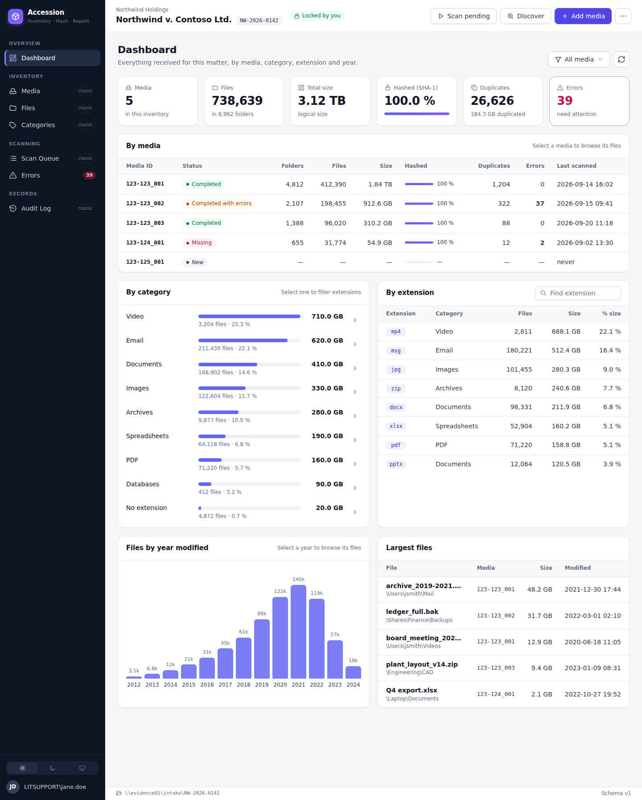
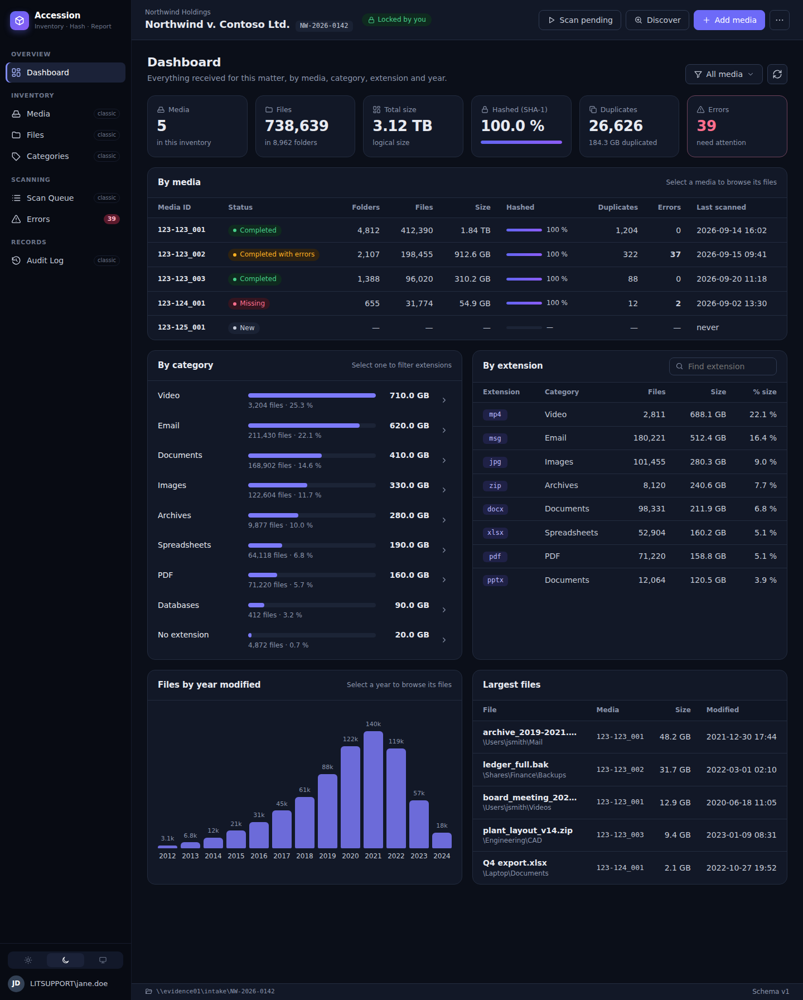
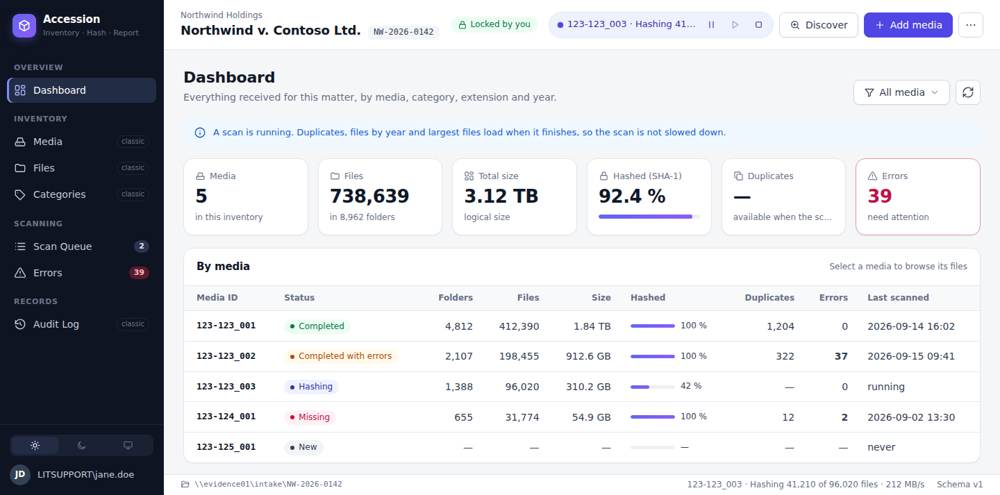
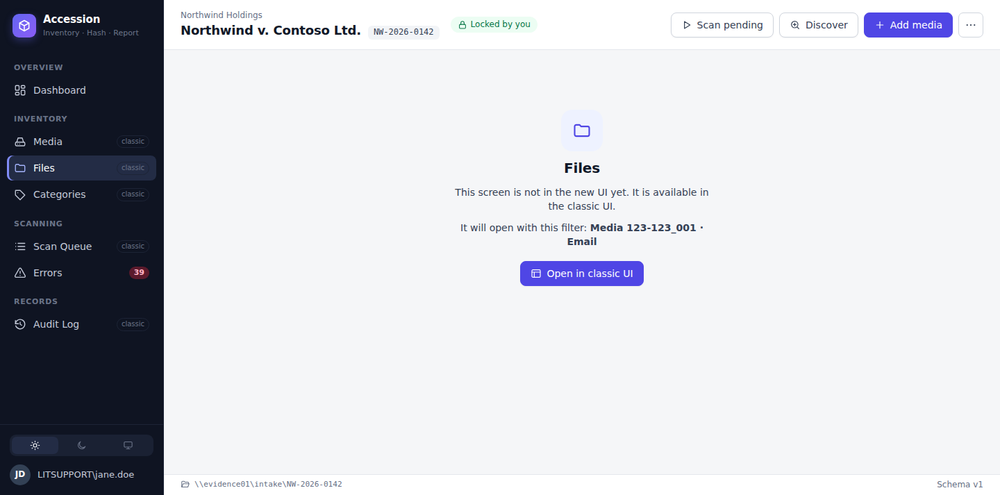

# 002 – Web-style UI (Blazor Hybrid) – plan

Status: **all screens and dialogs are in the web UI** (#65–#73). Tracked by epic #64. The classic screens are still
available (View → New UI (preview) off, or "Classic UI" in the page) until the switch-over (#74), which waits for a
check on Windows.

## 1. Goal

The classic WPF screens work but look like a default Windows app. The goal is a modern, web-app-style UI
(side navigation, cards, clean tables, charts, light/dark themes). The app stays an installed Windows
desktop app with the same evidence-handling guarantees.

## 2. Decision

**Blazor Hybrid**: the WPF window hosts a `BlazorWebView` (WebView2). Screens are Razor components
styled with HTML/CSS, running in the same process as the rest of the app.

| Kept as is | Changes |
|---|---|
| Accession.Core, Accession.Data (scan engine, queries, audit, locking) and their tests | Screens are Razor components in a new **Accession.UI** project instead of XAML views |
| DI host, `InventoryHost`, `ScanHost`, workflows, close flow | View models implement small UI-facing interfaces (`IShellModel`, `IDashboardModel`) |
| Windows dialogs (folder picker, message boxes) for now | Menus, banners and the busy overlay are drawn by the page |

Styling uses **plain CSS with design tokens** (no component library). This gives full control of the look
and no third-party UI dependency. The components we need (sidebar, cards, tables, pager, dropdowns,
dialogs) are small. There are no web fonts or CDNs: it works offline, and uses Segoe UI and Cascadia Mono.

Rejected: a WPF theme library (still looks like a desktop app), Electron/Tauri (second runtime, messages
between processes), WinUI 3/Avalonia (different native frameworks with no web look).

## 3. Architecture

```
Accession.App (WPF host, net10.0-windows10.0.17763.0, Razor SDK)
  ├─ MainWindow → WebShellView (BlazorWebView, wwwroot/index.html); classic XAML views until #74
  └─ Platform: WpfUiDispatcher : IUiDispatcher, WindowsDesktop : IDesktop, DialogService (native dialogs)
Accession.Presentation (net10.0 – no WPF)
  ├─ ViewModels: WebShellViewModel : IShellModel, DashboardViewModel : IDashboardModel, … (shared with the classic views)
  ├─ Services: InventoryHost, ScanHost, InventoryWorkflows, MediaWorkflows, navigation
  └─ Platform: IUiDispatcher (Post/Defer/Invoke), IDesktop (clipboard, Explorer, URLs, exit)
Accession.UI (Razor class library, net10.0 – no WPF)
  ├─ Shell: AppShell, ScreenHost (page by model type, one error boundary per screen), MenuItem, ClassicOnlyPage
  ├─ Dashboard: DashboardPage, IDashboardModel, row types
  ├─ Components: DataTable/Column (sortable, selectable, virtualized), Pager, Dropdown, Tabs, SplitPanel,
  │              EmptyState, Modal, ToastService/ToastHost, ScreenErrorBoundary, Icon
  ├─ Infrastructure: ObservingComponentBase (re-renders on property/collection/CanExecute changes, batched)
  └─ wwwroot/css/accession.css (tokens, light/dark, layout, components)
```

Rules the prototype set, which the rest of the migration follows:

- **Screens are chosen by model type**: each navigation item carries its screen's model and `ScreenHost` maps it
  to a page. The model outlives the page, so filters, selection and page number survive switching screens.
- **Components know only interfaces** from Accession.UI. They never reference WPF, Data or the host. This keeps
  them testable on any OS. The tests render them with `HtmlRenderer`, which also produces the preview pages.
- **Commands that may open a Windows dialog run after the web event returns** (`await Task.Yield()` in
  `ObservingComponentBase.Run`), because a modal dialog inside a WebView2 event handler can block the WebView.
- **The web view is disposed on a later dispatcher pass**, because "Close inventory" or "Switch to classic UI" is
  clicked inside the page that is being replaced.
- **The WebView2 profile** is kept in `%LOCALAPPDATA%\Accession\WebView2`, because the default location next to the
  exe is read-only under Program Files.
- **WPF can't draw over the WebView2 control**, so the page draws its own busy overlay (from `BusyTracker`).
- **Themes**: `system` (follows Windows), `light` or `dark`. This is stored in settings (`WebTheme`).

## 4. Prototype (this change)

- **View → New UI (preview)** switches the open inventory to the web shell. The setting is remembered (`UseWebUi`).
- **Shell**: dark sidebar grouped Overview / Inventory / Scanning / Records, with badges for the scan queue and
  errors. The top bar has the matter, client and code, a lock/read-only chip and an offline chip, and live scan
  controls (pause, resume, cancel) while a scan runs. It also has Scan pending, Discover and Add media, plus a
  "…" menu (Properties, Change root path, Matter link, Settings, Switch to classic UI, Close inventory). A
  status bar and notice/offline banners complete it.
- **Dashboard**: KPI cards (media, files/folders, size, hashed with a progress bar, duplicates, errors), media
  filter dropdown, By media table, category bars (click to filter extensions, arrow to open files), extension
  table with search, files-by-year column chart and largest files. It uses the same click-through filters as
  the classic Dashboard.
- Screens not migrated yet show "Open in classic UI". A Dashboard click-through carries its Files filter over
  to the classic Files screen.

| Light | Dark |
|---|---|
|  |  |

| Scan running | Screen not migrated yet |
|---|---|
|  |  |

Screenshots are rendered from the components with sample data (see
`tests/Accession.Tests/WebUi`; set `ACCESSION_UI_PREVIEW_DIR` to write the preview pages).

## 5. Files screen: pagination (required)

The web Files screen uses **pages** instead of an endless scrolling grid.

- **Rows per page**: 1,000 (default) / 2,000 / 5,000 / 10,000 / 50,000, remembered between sessions (settings).
- **Pager**: First · Previous · *Page N of M* · Next · Last, a "Go to page" box, and "Showing 1,001–2,000 of 738,639 files".
- **Large pages stay responsive**: the table draws only the rows in view (Blazor `Virtualize` over the loaded
  page), so a 50,000-row page doesn't build 50,000 table rows. The header stays fixed and the scrollbar covers
  the whole page. Rows load in the background with a spinner.
- **Fast paging on 10M+ rows**:
  - *Next/Previous* use the existing keyset query (`FileBrowserQueries.Page` with `FilePageCursor`, no OFFSET).
  - *Last* runs the same query with the sort order reversed.
  - *Go to page N* uses `LIMIT/OFFSET` on the sort index. Jumping deep into 10M rows may take a second or two,
    so it shows a small spinner. Visited page boundaries are cached, so going back is instant.
  - *Page count* comes from the existing totals query (`FileTotals`), which also feeds the "Showing …" line.
- Changing a filter, sort, folder or page size returns to page 1. While a scan adds rows, the total refreshes
  and the current page stays where it is.
- Row actions: copy path, copy SHA-1, open containing folder, show all copies (same SHA-1). Column chooser is kept.

## 6. Epic and tickets

**Epic #64: Web UI (Blazor Hybrid)**. Prototype: #65.

1. **Presentation layer** (#66): move the view models to a WPF-free project (replace the static `UiThread` with an
   `IUiDispatcher`), add a UI interface per screen, and log unhandled page errors (blazor-error-ui).
2. **Start screen** (#67): recent inventories, New/Open, and lock-conflict/root-unreachable prompts as web dialogs.
3. **Media screen** (#68): media table, detail panel with scan history, Add/Delete/Scan actions, missing-media state.
4. **Files screen** (#69): folder tree, filter bar, **paged table with rows-per-page** (section 5), row menu, columns.
5. **Scan Queue and Errors screens** (#70): live progress, reorder/remove, retry failed, error filters.
6. **Categories and Audit Log screens** (#71).
7. **Dialogs in the web UI** (#72): New inventory, Add media, Delete media, Settings, Properties, Change root path.
   The folder picker stays the native Windows dialog.
8. **Keyboard and accessibility** (#73): shortcuts (Ctrl+O, F5, Ctrl+F), focus order, screen-reader labels,
   Windows high-contrast, and text scaling.
9. **Switch-over** (#74): make the web UI the default, remove the classic XAML views and the View menu toggle, and
   update docs. The installer (#59) checks for or bundles the WebView2 Evergreen runtime.

Excel export (#9) and Quality (#10) continue in parallel. The export options dialog is built as a web
dialog once #72 is in.

## 7. Risks and open points

- **WebView2 runtime**: it comes with Windows 11 and is kept updated on Windows 10. The MSI must check for it
  (bootstrapper or bundled Evergreen installer) for offline machines.
- **Can't be verified in CI**: the page is rendered and asserted in tests, but WebView2 itself only runs on
  Windows. Each screen ticket needs a manual check on Windows (checklist in the PR).
- **Memory**: WebView2 adds roughly 100–150 MB. That's acceptable for a desktop tool; it's measured in #62.
